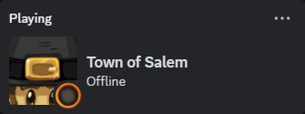
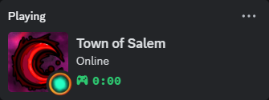
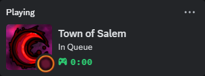
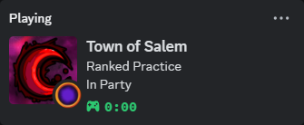
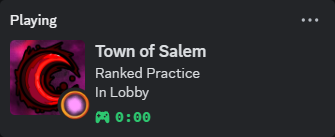
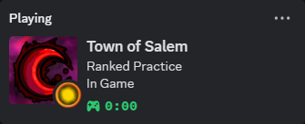

# Salem Rich Presence
Present your Town of Salem activity on Discord!

There are six main statuses:

 

The large image in the offline status depends on whether the Steam service is available and your Steam account has the Coven DLC.
The large image in the other statuses depends on whether the account you are logged in with has the Coven premium.

The in-game status will include details of the ongoing day-night phase and, later, the winning faction.
